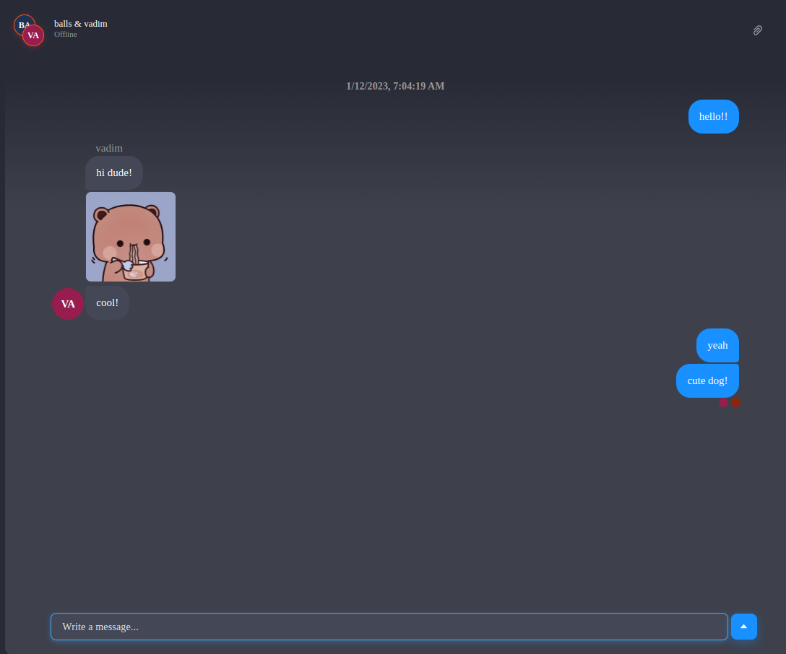

# Chat with groups on Flask/React

## Example "Best friends":




Installation
------------

Create file `.env` or delete `.example` in the `.env.example` file

Fill in the data in the file `.env`

```.env```

```dotenv
CHAT_ENGINE_PROJECT_ID=
CHAT_ENGINE_PRIVATE_KEY=
```


```frontend/.env```

```dotenv
REACT_APP_CHAT_ENGINE_PROJECT_ID=
```

**[Keys](https://chatengine.io/)** for application


Run
-----

```
docker-compose up -d
```

### Standard ports

* [Backend](http://localhost:8000/): 8000
* [Frontend](http://localhost:3001/): 3000
